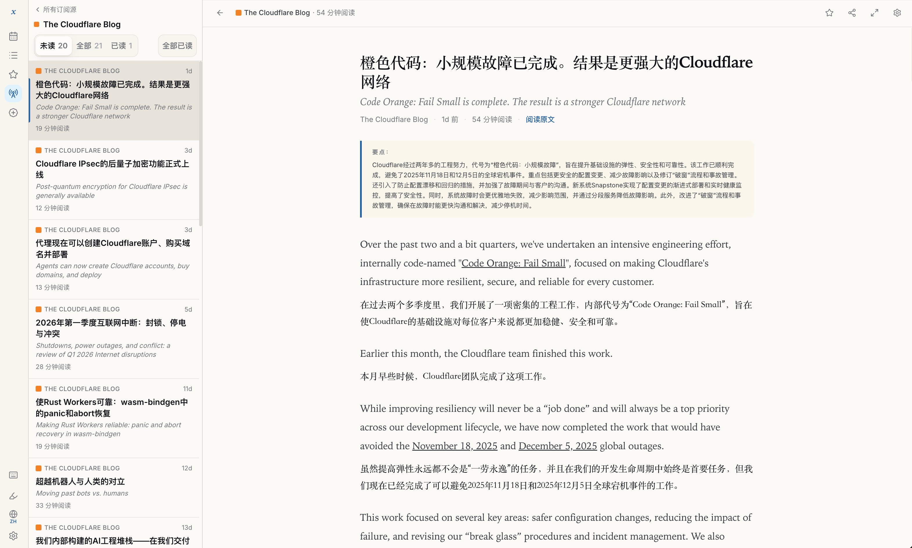

<div align="center">

# xReader

**Self-hosted RSS reader with AI-powered translation & key points**

**AI 驱动的自托管 RSS 阅读器 — 自动翻译 + 要点总结**

[Features](#features) · [Quick Start](#quick-start) · [Fever API](#fever-api) · [中文](#中文)

</div>




---

## Features

- **AI Bilingual Reading** — Titles auto-translated, paragraphs rendered side-by-side, 3-5 bullet key points per article
- **Fever API** — Connect Reeder, NetNewsWire, Unread, and other native clients
- **Full-Text Search** — CJK-aware search across all articles, no plugins needed
- **Highlights & Notes** — Select text, highlight, annotate
- **Dark Mode + Themes** — Light/dark/system with 4 accent colors
- **OpenAI-Compatible AI** — Works with DeepSeek, Moonshot, one-api, OpenRouter, or any relay
- **Simple Deployment** — Single binary + Postgres, 2 containers
- **Keyboard-First** — J/K navigate, S star, E mark read, / search

## Quick Start

```bash
git clone https://github.com/razeencheng/xreader.git
cd xreader
echo "SESSION_SECRET=$(openssl rand -hex 32)" > .env

docker compose up -d

# Check logs for the Setup Token
docker compose logs xreader | grep "SETUP TOKEN"

# Open http://localhost:3000/setup → enter token → configure
```

## Configuration

| Variable | Required | Description |
|---|---|---|
| `DATABASE_URL` | Yes (auto in compose) | Postgres connection string |
| `SESSION_SECRET` | Yes | Random string for session signing |
| `GITHUB_CLIENT_ID` | No* | GitHub OAuth App Client ID |
| `GITHUB_CLIENT_SECRET` | No* | GitHub OAuth App Client Secret |
| `SETUP_TOKEN` | No | Fixed setup token (auto-generated if unset) |
| `XREADER_AI_ENCRYPTION_KEY` | No | Custom encryption key for stored secrets |

*Configured via Setup Wizard on first run, or set as env vars.

## Fever API

Connect third-party RSS clients:

1. Go to **Settings → Third-party Clients**
2. Set a Fever password
3. In your client, add a Fever account:
   - **Server:** `https://your-domain/fever/`
   - **Username:** your GitHub username
   - **Password:** the password you set

Tested with: Reeder, NetNewsWire, Unread.

## Development

```bash
# Prerequisites: Go 1.25+, Node.js 20+, pnpm, Docker

# Start database
make up

# Backend
cd server && go run ./cmd/xreader

# Frontend (separate terminal)
cd web && pnpm install && pnpm dev

# Tests
make test
```

## Roadmap

- [ ] Local username/password auth
- [ ] Auto-cleanup retention policies
- [ ] PWA support
- [ ] Health monitoring dashboard
- [ ] More adapters (HackerNews, Reddit, Newsletter)
- [ ] Google Reader API

## Contributing

See [CONTRIBUTING.md](CONTRIBUTING.md).

## License

[AGPL-3.0](LICENSE)

---

## 中文

### 功能亮点

- **AI 双语阅读** — 标题自动翻译，原文+译文段落交替排列，每篇文章 3-5 条要点摘要
- **Fever API** — 支持 Reeder、NetNewsWire、Unread 等第三方客户端
- **全文搜索** — 支持中日韩文搜索，无需额外插件
- **高亮和笔记** — 选中文字高亮，添加笔记
- **深色模式 + 主题** — 浅色/深色/跟随系统，4 种强调色
- **OpenAI 兼容** — 支持 DeepSeek、Moonshot、one-api、OpenRouter 等中转
- **极简部署** — 单个二进制 + Postgres，仅 2 个容器
- **键盘优先** — J/K 导航、S 收藏、E 标记已读、/ 搜索

### 快速开始

```bash
git clone https://github.com/razeencheng/xreader.git
cd xreader
echo "SESSION_SECRET=$(openssl rand -hex 32)" > .env

docker compose up -d
docker compose logs xreader | grep "SETUP TOKEN"
# 打开 http://localhost:3000/setup → 输入令牌 → 完成配置
```
